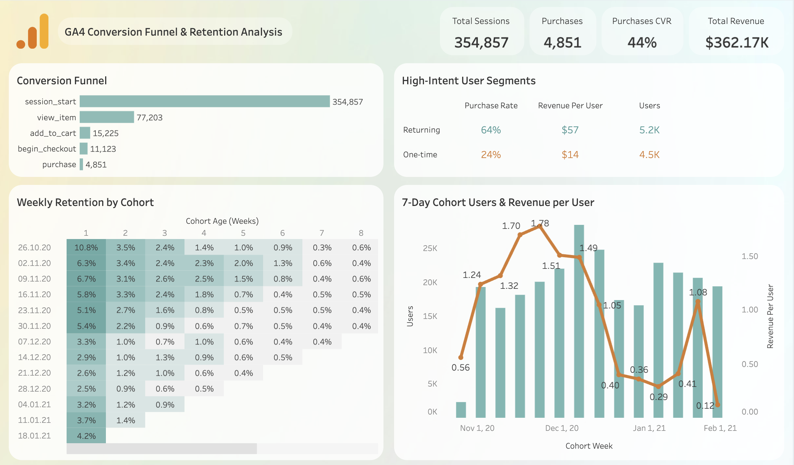

# GA4 Conversion Funnel & Retention Analysis

An end-to-end analytics project exploring customer behavior in the Google Analytics 4 Sample Ecommerce dataset using **Google BigQuery** and **Tableau**.

The project examines how users progress through the conversion funnel, how customer retention affects revenue, and which user segments create the highest business value. The goal is to transform raw event-level data into actionable business insights.

🔗 **Interactive Dashboard:** *([Tableau Public link](https://public.tableau.com/app/profile/anna.kaminovska/viz/GA4E-commercePerformanceDashboard/Dashboard1#2))*

---

## 📊 Dashboard Preview



---

## Business Questions

This analysis focuses on answering the following questions:

- Where do users leave the purchase funnel?
- Which stage contributes the largest drop-off?
- How does customer retention change over time?
- Do returning users generate more value than first-time visitors?
- Does conversion performance vary across devices?

---

## 💡 Key Findings

- More than **354,000 sessions** were analyzed, but only **22%** reached a product page, making product discovery the largest point of friction.
- Returning users significantly outperform first-time visitors, generating nearly **4× higher revenue per user** and converting almost **3× more often**.
- Once users begin the checkout process, the purchase completion rate remains relatively strong, suggesting that the primary opportunity lies earlier in the customer journey.
- User retention drops sharply after the first visit, indicating strong potential for re-engagement campaigns and lifecycle marketing.

---

## 🎯 Business Recommendations

- **Increase product visibility** by improving navigation, search, and product recommendations to move more users beyond the first interaction.
- **Invest in customer retention**, as returning users generate substantially higher revenue and conversion rates than one-time visitors.
- **Prioritize early-funnel optimization** instead of checkout improvements, since the largest customer loss occurs before product exploration.
- **Implement re-engagement campaigns** such as email automation or personalized offers to encourage repeat visits.

---

## Dashboard Overview

The Tableau dashboard includes:

- Executive KPI summary
- Conversion funnel analysis
- Weekly cohort retention
- 7-day cohort revenue analysis
- High-intent customer segmentation

---

## Repository Structure

```text
ga4-ecommerce-analysis/
│
├── dashboard/
├── sql/
└── README.md
```

---

## 🛠️ Tools

- Google BigQuery
- SQL
- Tableau
- Google Analytics 4 Sample Ecommerce Dataset
